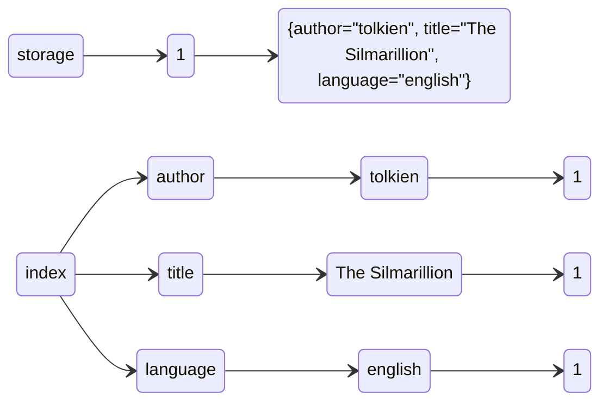
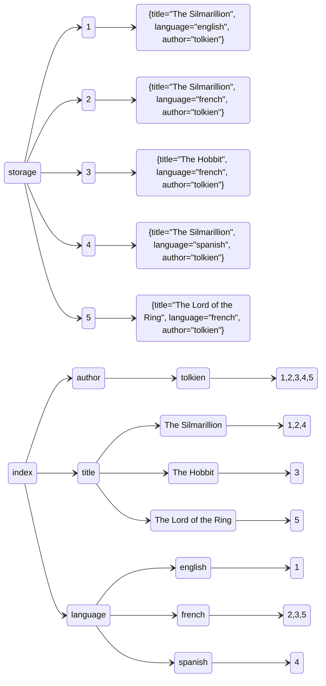

Tiny in-memory database made to search accross milions of records very quickly

# Rusted Post

Rusted post is an index/search engine. It's goal is to quickly find record that matched N set of labels.

The main way to interract with the system is to append or search records. A record is a set of labels each
containing a key and a value: `{author="tolkien", title="The Silmarillion", language="english"}`
The search query is very similar: `{author_family_name=="Tolstoy", title=~"A[n]?na.*"}`. The display
format is very close to PromQL (Prometheus querly language) because it's clean and human readable.

# Architecture

Rusted Post as its name imply is build around posting lists: all records are assigned with a single
record Id (u32). When a record is indexed, this record Id is appended to all the values of each labels.

Example:
```
{author="tolkien", title="The Silmarillion", language="english"} is assigned 1

In the index:
tolkien = [1]
The Silmarillion = [1]
english = [1]
```




```
We add more records:
{author="tolkien", title="The Silmarillion", language="french"} with 2
{author="tolkien", title="The Hobbit", language="french"} with 3
{author="tolkien", title="The Silmarillion", language="spanish"} with 4
{author="tolkien", title="The Lord of the Ring", language="french"} with 5

In the index:
# Authors
tolkien = [1, 2, 3, 4, 5]

# Titles
The Silmarillion = [1, 2, 4]
The Hobbit = [1, 2, 4]
The Lord of the Ring = [1, 2, 4]

# Languages
english = [1]
french = [2, 3, 5]
spanish = [4]
```



```
Now if we want to search for all the books named `The Silmarillion` written by `Tolkien` in `French` we just have
to instect the corresponding arrays:
french && (Intersect) tolkien && The Silmarillion -> [2] -> {author="tolkien", title="The Silmarillion", language="french"}
```

Computing intersections of sorted integers is much fast than scanning
though all the record in the database.

As the goal of this project is to optimize the code for search performance and memory usage, you can
check the optimisation that were done in `PERFORMANCE.md`


# How to use

As of today, it's not usable as is as the data ingestion and search are hardcoded.

```
cargo run
```

UI is reachable on `localhost:8080` by default

# Generating the dataset

Checkout the code in `data/generate_from_lib_gen.py`, it requires a dump of the lib genesis index
that is fed to an sqlite database (the dump is a mysql compatible dump, so some conversion is required
clean output).
The dataset is a list of 2M books with authors, langage and format information. This dataset is then
used as benchmark reference to search things like "all the books by Tolkien in pdf and in english"
